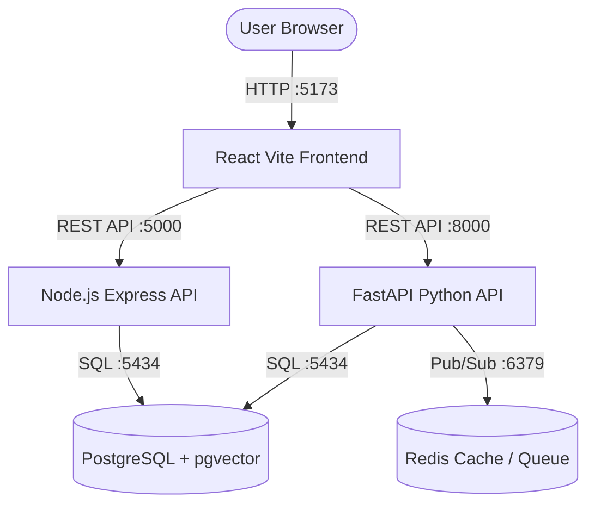

# 🤖 AI Digital Twin Full-Stack Monorepo

A modern, high-performance AI Digital Twin application featuring a **React (Vite) Frontend**, dual backends with **Node.js Express API** and **FastAPI Python (Vector Store / AI Processing)**, supported by **PostgreSQL (pgvector)** and **Redis**.

---

## 🏗️ Architecture Overview



---

## ⚡ Key Features

- **React Frontend**: Built with Vite, React-Bootstrap, and React Router. Includes live backend connectivity status pills in the navigation bar.
- **Node.js Express Backend**: Primary API server handling database sessions, user profiles, and CRUD logic.
- **FastAPI Python Backend**: AI/Vector embedding engine integrated with `pgvector` for semantic search and async task processing via Redis.
- **PostgreSQL + pgvector**: Relational database extended with vector similarity search (`hnsw` index).
- **One-Command Startup**: Launch all microservices, database, and Redis cache in **one go** using standard dev scripts or Docker Compose.

---

## 📂 Project Structure

```
ai-digital-twin/
├── database/
│   ├── migrations/
│   │   └── init.sql         # PostgreSQL schema & pgvector initialization
│   ├── models.py            # SQLAlchemy ORM Models
│   └── session.py           # DB connection session factory
├── fastapi-backend/
│   ├── app/                 # FastAPI application routes & main entrypoint
│   ├── worker/              # Redis background tasks
│   └── Dockerfile
├── node-backend/
│   ├── src/                 # Express controllers, routes, & db handlers
│   └── Dockerfile
├── frontend/
│   ├── src/                 # React components, pages, & API services
│   └── Dockerfile
├── docker-compose.yml       # Multi-container orchestrator
├── package.json             # Root monorepo scripts
├── start.bat                # Windows one-click launcher script
├── .env.example             # Template for environment variables
└── README.md
```

---

## 🚀 Getting Started

### Prerequisites

Ensure you have the following installed on your machine:
- **Node.js** (v18+)
- **Python** (v3.10+)
- **Docker Desktop** (running)

---

### Environment Setup

1. Clone the repository:
   ```bash
   git clone <repository-url>
   cd ai-digital-twin
   ```

2. Copy the example `.env` file:
   ```bash
   cp .env.example .env
   ```

---

### 🏃 Running the Application ("In One Go")

#### Method 1: Standard Development Mode (Recommended)

Run the one-click startup script (or `npm start`):

**On Windows:**
```cmd
start.bat
```
or via npm:
```bash
npm start
```

This command automatically:
1. Starts PostgreSQL (`:5434`) and Redis (`:6379`) via Docker.
2. Launches Node.js API (`:5000`), FastAPI (`:8000`), and React Frontend (`:5173`) concurrently.

---

#### Method 2: Full Docker Container Mode

To run all services fully containerized inside Docker:

```bash
npm run docker:up
```
*(or `docker compose up --build`)*

To stop all containers:
```bash
npm run docker:down
```

---

## 🌐 Service URLs & Health Endpoints

| Service | Local URL | Health Endpoint | Description |
| :--- | :--- | :--- | :--- |
| **Frontend** | `http://localhost:5173` | - | React UI (Library & Test Page) |
| **Node.js API** | `http://localhost:5000` | `http://localhost:5000/health` | Primary Express Backend |
| **FastAPI** | `http://localhost:8000` | `http://localhost:8000/health` | Python AI Backend & Docs (`/docs`) |
| **PostgreSQL** | `localhost:5434` | - | `twin_db` database |
| **Redis** | `localhost:6379` | - | Cache & Queue |

---

## 🛠️ API Quick Reference

### Node.js Backend (`http://localhost:5000`)
- `GET /health` - Database & Server Health Check
- `GET /api/students` - List all registered students
- `POST /api/students` - Create a student profile (`{ "email": "...", "full_name": "..." }`)

### FastAPI Backend (`http://localhost:8000`)
- `GET /health` - FastAPI Health Check
- `GET /api/v1/students` - List students via SQLAlchemy ORM
- `GET /api/v1/chunks` - List knowledge chunk embeddings

---

## 📜 License

ISC License
